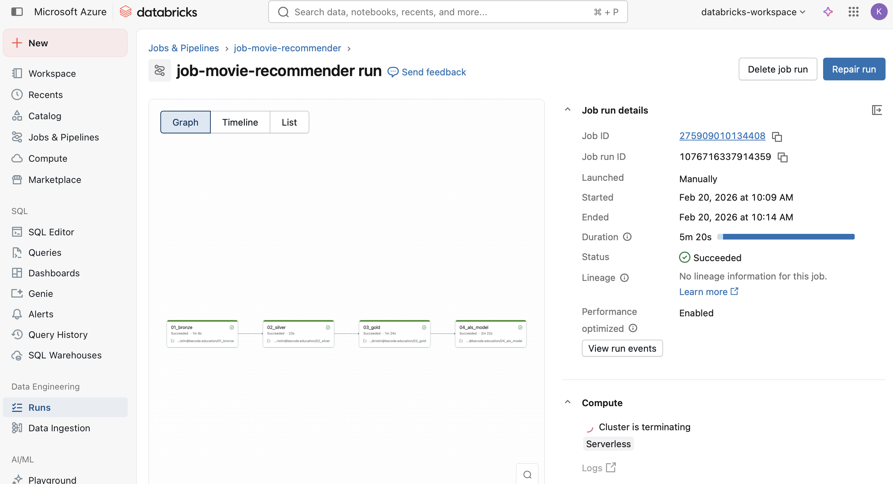
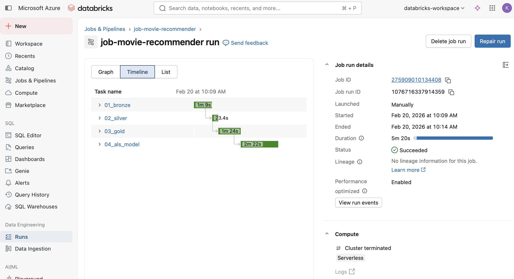

# 🎬 MovieLens Lakehouse Recommender
PySpark | Delta Lake | Azure Databricks (Community Edition)

## Overview
This project simulates a real-world data engineering scenario at a streaming platform.
The objective was to build a production-style Lakehouse architecture using the Medallion design pattern and train a recommendation model using Spark MLlib.
Data originates from multiple fragmented sources (mainly CSV) and is progressively refined across Bronze, Silver, and Gold layers before training an ALS recommendation engine. Finally a workflow pipeline was orchestrated using Databricks Jobs.

- Environment Azure Databricks (Community Edition)
- Language PySpark
- Storage Delta Lake

## Repository
https://github.com/kristinnuyens/movie-recommender

## Architecture
```
      Raw Data
          ↓
  Bronze (Raw Delta)
          ↓
Silver (Cleaned & Joined)
          ↓
 Gold (Business Ready)
          ↓
ALS Model (Recommendations)
```

## Data Sources
- MovieLens Ratings (CSV)
- MovieLens Movies (CSV)
- MovieLens Links (CSV)
- External metadata for enrichment (CSV) via TMDB API

# 🥉 Bronze
Raw data is ingested and stored as Delta tables without transformation

Key:
Bronze stores immutable raw data in Delta format to ensure reliability, reproducibility, and traceability

Tables:
- bronze_ratings_csv
- bronze_movies_csv
- bronze_links_csv

# 🥈 Silver
Data quality enforcement and relational modeling

Actions:
- Explicit schema casting
- Timestamp normalization
- Deduplication
- Genre parsing into ArrayType
- Left joins for referential integrity
- Creation of fact and dimension tables

Key:
Silver cleans, validates, and structurally models the data into reliable fact and dimension tables

Tables:
- silver_fact_ratings
- silver_dim_movies_enriched
- silver_dim_users

# 🥇 Gold
Business-ready, optimized datasets for analytics and ML

Actions:
- User-level aggregations
- Final fact table for model training
- Clean dimensional enrichment
- Null validation
- Structured ML training dataset

Key:
Gold aggregates and optimizes trusted data into business-ready datasets for analytics and machine learning

Tables:
- gold_fact_ratings
- gold_dim_users
- gold_dim_movies_enriched

## Machine Learning - ALS model
ALS: Alternating Least Squares

ALS collaborative filtering model:
- Cold start handling
- Top 10 recommendations per user
- Results stored in Delta

## How to Run
### Option 1: Manual
1. Execute 01_bronze notebook
2. Execute 02_silver notebook
3. Execute 03_gold notebook
4. Execute 04_als_model notebook
### Option 2: Automated (Recommended)
Trigger the Databricks Workflow job

Each task depends on successful completion of the previous one

## Workflow/Job Execution
Job run overview

Execution timelines


## ⚠️ Azure Databricks Community Edition Limitations
| **Limitation** | **Impact** |
| -------------- | ---------- |
| Single-node cluster | Limited scalability testing |
| No Unity Catalog | Simplified governance |
| Limited job configuration | Basic orchestration only |

Despite constraints, the full Medallion + ML pipeline was successfully orchestrated.

# 🏁 Conclusion
This project demonstrates:
- End-to-end Lakehouse implementation
- Medallion architecture discipline
- Multi-source data engineering
- Spark ML integration
- Workflow orchestration in Databricks

It reflects a production-style engineering approach within Community Edition constraints.

# 🧑‍💻 Contributors

While a team of 4 female aspiring Data Engineers was assigned, we decided to work on the project individually for an optimized learning experience. I was assigned the project leader. This project is therefore considered a solo project, except for the presentation, on which we shared learnings.
- Kristin Nuyens

# ⏰ Timeline

7 working days